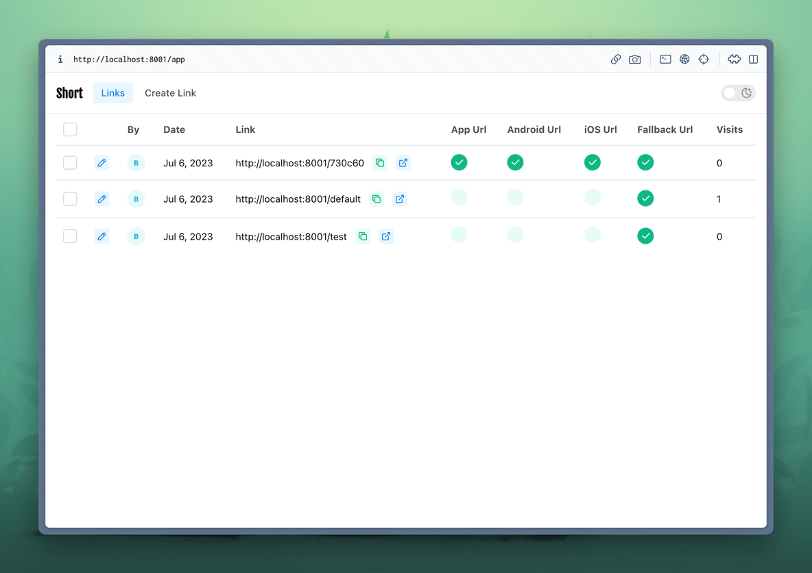

## Laravel-Inertia URL Shortener for Mobile Links

This is a simple URL shortener for mobile links.  
It generates short URLs for mobile links to deep link into mobile apps, if the app is installed.  
If the app is not installed, it redirects to the App Store or Google Play Store.  
If the link is opened on a desktop browser, it redirects to the web page.  

App is built with Laravel, Inertia.js, React.js and Mantine UI Kit.



## Installation

```bash
cp .env.example .env
composer install

# Start docker containers
./vendor/bin/sail up

# Generate app key
./vendor/bin/sail artisan key:generate

# Run database migrations
./vendor/bin/sail artisan migrate

# Install npm dependencies
npm install

# Start frontend development environment
npm run hot
```

Visit to access the app:
http://localhost:8001

You can adjust following ports from `.env` file if needed:

```ini
APP_PORT=8001
APP_URL=http://localhost:8001

# Docker/Sail Ports. See docker-compose.yml for details.
FORWARD_DB_PORT=33061
FORWARD_REDIS_PORT=63791
```

### Testing

```bash
./vendor/bin/sail artisan test
```
